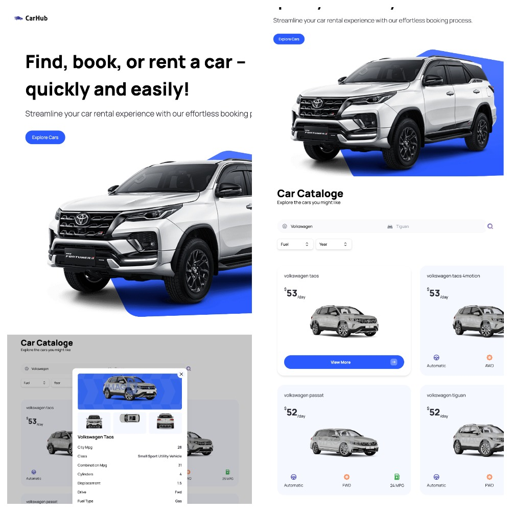

# Car Rent Next.js(SSR) + TypeScript + TailwindCSS



## Запуск проекта
1) Установить зависимости

```bash
npm install
```
2) Запустить проект в режиме разработки на [http://localhost:3000](http://localhost:3000)
```bash
npm run dev
# or
yarn dev
```
(!) Убедитесь что используете VPN.

Открыть [http://localhost:3000](http://localhost:3000) в браузере.

## О проекте:
- Первый опыт использования TypeScript;
- Проект представляет собой простой, на данный момент, одностраничный сайт;
- Благодаря Next.js используется SSR;
- Для получения данных автомобилей используется [RapidAPI](https://rapidapi.com/apininjas/api/cars-by-api-ninjas);
- Для получения изображений автомобилей используется [Car Images API](https://www.imagin.studio/);

## Реализовано: 
- Адаптивная верстка;
- Пагинация, поиск, фильтрация;
- Серверные компоненты;
- Модальное окно Headless UI;

